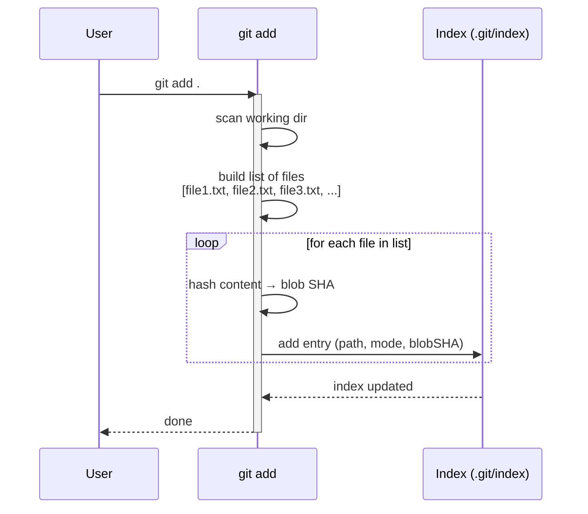

A very basic command to push the modified files and their changes towards the staging area.
Every modified file or new file you create and changes you make need to be pushed towards staging area.

Staging (index) : This is a index that stores changes that needs to be committed. .git/index is the binary file .

Its two jobs:

Stage changes — git add writes the current file content as a blob and updates the index entry to point to it. 
 
Fast dirty detection — When we do git add . then git status compares index metadata (mtime, size) against the working tree files without reading full content.
    But when we do git add fileName.extension then no detection is done. File converted to blob and index is updated as described below.

Step	Action	
        Plumbing equivalent command
1	Read the file's current content from the working directory	—
2	Compress (zlib) the content and write it as a blob into .git/objects/	
        Command : git hash-object -w file
3	Compute the blob's SHA-1	(done inside step 2)
4	Write/update an entry in .git/index with: path, mode, blob SHA-1, stat info	
        Command : git update-index --add --cacheinfo 100644 <sha> file

