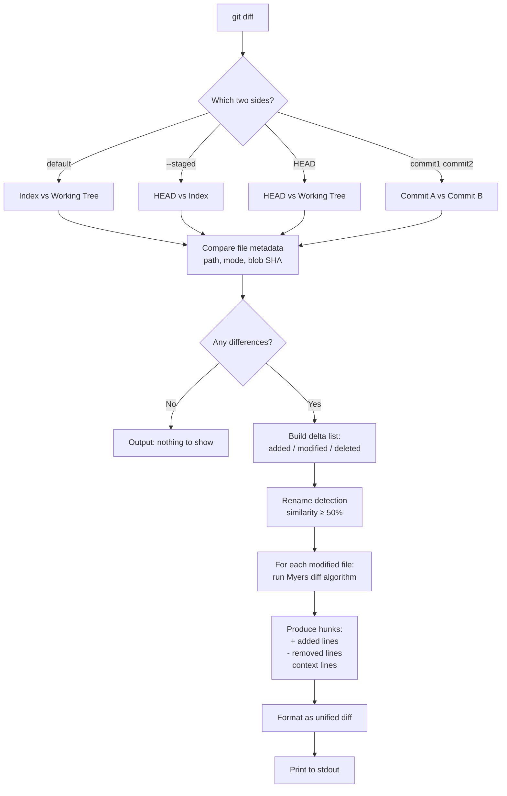

This command is used to show changes between the different levels of the current branch, workspace directory and commit history


```
git diff  : show the unstaged changes from the staged changes(index). If changes commited then nothing is shown.
git diff --staged : show the added/removed changes from last commit(HEAD) to staged changes
git diff HEAD : show the difference between commited and unstaged changes.

git diff commitID_1 commitID_2 : show the difference between the two commit ids 
git diff branch_1 branch_2 : show the diff b/w two branches current/lastest HEAD to their common ancestor
```


Term	What it is
HEAD	The last commit (snapshot in .git/objects)
Index (Staging Area)	The "next commit" blueprint in .git/index
Working Tree	Your actual workspace directory on disk

