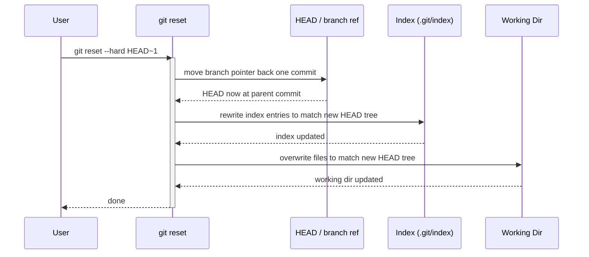

This command is used to forget changes at three levels/trees.
HEAD
Staging Area(Index)
Workspace Directory(local)
```
git reset --soft <commitId>  : Moves HEAD to the specified commit but keeps all changes staged in the index.
git reset --mixed <commitId> :This is one level deeper then soft. It unstages the changes but keep them in workspace directory.
git reset --hard <commitId> : This is move HEAD + forget all changes from index + workspace directory. So all your changes are gone and the only code is now the commitId level code
git reset <file> : Unstage the file but keep it in WSDirectory, head remains on the branch and to the last commit
```

```
git reset --hard HEAD~2 : go 2 commits back in history and forget all changes
git reset --mixed HEAD~2 : go 2 commits back in history but keep all the changes after that in workspace directory but not in index
git reset --soft HEAD~2 : go 2 commits back in history but keep the changes done after that in the index staging area
```


